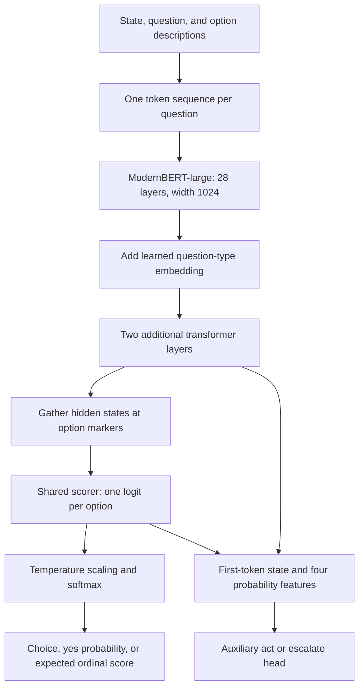

# Laya architecture and local trial

Inspected 25 September 2026. **Yes: Laya is on GitHub and its weights are downloadable. The English model is approximately 421.3M parameters, rather than 410M.**

- Code: [NandhaKishorM/laya](https://github.com/NandhaKishorM/laya), Apache 2.0.
- Weights: [convaiinnovations/laya](https://huggingface.co/convaiinnovations/laya/tree/main), Apache 2.0.
- Downloaded code: [source/](source/), commit `4066d5d5fbf08b66c6757ddeedbd797bd7655bc0`.
- Prepared local example: [try_laya.py](try_laya.py). Not executed.

The source checkout is approximately 12 MB. Model weights have **not** been downloaded: the English `model.safetensors` is listed as **843 MB**. The full Hub repository is larger because it bundles sibling checkpoints; the Laya loader selectively downloads the requested checkpoint. [Weight files](https://huggingface.co/convaiinnovations/laya/tree/main), [download implementation](source/laya/agent.py)

## The actual network

**Laya = bidirectional ModernBERT encoder + two transformer head layers + option scorer + auxiliary action head.** It is a transformer-based neural network, with no diffusion sampler in this inference path.



| Component | English checkpoint details |
|---|---|
| Encoder | ModernBERT-large; approximately **394.8M parameters** |
| Encoder configuration | **28 layers**, hidden width **1,024**, **16 attention heads**, FFN intermediate width **2,624** |
| Attention | Alternating global/sliding attention; global every third layer; local window configuration 128 |
| Decision-head stack | **2 transformer layers**; 16 attention heads per layer, width 1,024, FFN width **4,096**, pre-layer normalization |
| Question type | Learned embedding for the three question types, added to all token states |
| Option scorer | LayerNorm → Linear(1,024, 1,024) → GELU → Linear(1,024, 1) |
| Action head | Linear(1,028, 256) → GELU → Linear(256, 2) in the default configuration |
| Added head parameters | Approximately **26.5M**; total approximately **421.3M** |

Sources: [parameter breakdown](source/research/scripts/laya_benchmark_colab.ipynb), [DecisionModel implementation](source/laya/common.py), [published encoder configuration](https://huggingface.co/convaiinnovations/laya/blob/main/encoder/config.json). Counts are published approximations, not a count performed by loading the model here.

## How a request moves through it

The input builder constructs a sequence with the question first, then marked options, then state. Each option gets a `[MASK]` marker. The scorer reads the contextual hidden state at each marker, producing one number per option. Since the whole input is bidirectional, each marker can incorporate the question, state, and other options. Softmax turns these scores into a distribution; the runtime applies the checkpoint's temperature settings first. [Input builder and network](source/laya/common.py), [answer decoding](source/laya/agent.py)

The action head combines the first token's representation with four features: maximum probability, top-two probability gap, normalized entropy, and scaled option count. Its output is auxiliary; it should not be assumed to provide a validated abstention policy for your domain.

**Batching detail:** the runtime tokenizes shared state once, but builds a separate sequence for each question. Multiple sequences can run in one batched forward invocation. This is not one shared encoder representation reused across all question heads; encoder work still scales with the question rows. [Agent._encode_state](source/laya/agent.py)

## Context, training, and memory

The English checkpoint defaults to **512 tokens total per question**, with **192 tokens for the question/options budget**. The state receives the remaining space. Although ModernBERT's position capacity is 8,192, that does not make this English checkpoint a validated 8K decision model. [Checkpoint settings](https://huggingface.co/convaiinnovations/laya/blob/main/rl_agent_config.json)

The smaller multilingual variant is approximately **322M parameters** and uses mmBERT-base. The 421M `typed-decisions` variant is specialized on four benchmark workflows. Begin with English for short English tests; explicitly select other checkpoints when comparing them. [Checkpoint family](https://huggingface.co/convaiinnovations/laya)

The public fine-tuning notebook updates encoder and head using noisy-logit policy gradients with proper-scoring rewards **plus soft-label cross-entropy**, followed by temperature fitting. It is an independent training implementation, not a disclosure of Jev's internals. [Training notebook](source/notebooks/laya_finetune_typed_decisions_2xT4_kaggle.ipynb)

Calculated weights-only memory is about **0.84 GB at 16-bit** or **1.69 GB at 32-bit** (`421.3M × bytes per parameter`). Actual RAM/VRAM use is higher because of activations, framework allocations, and loading buffers. You do not need a B200-class GPU to try this model. The runtime supports CPU and Apple MPS; this machine reports `arm64`. [Device selection](source/laya/agent.py)

## Commands for you to run

These commands create the environment and install the already-downloaded source. Use an available Python 3.10+ interpreter; none of these commands has been executed by the assistant.

```bash
cd /Users/ddod/LEANMCP/JEV_RELATED/Laya_Architecture
python3 -m venv .venv
.venv/bin/python -m pip install -e ./source

# First call downloads only the English checkpoint and its configuration/tokenizer.
USE_TF=0 .venv/bin/python try_laya.py --device cpu

# Optional comparison on an Apple Silicon GPU with working PyTorch MPS support.
USE_TF=0 .venv/bin/python try_laya.py --device mps
```

The example uses the weight revision recorded by the source project, prints model-loading time separately, shows three labeled cases, and measures warm single-question and three-question latency. It uses `laya.load`, so it loads one checkpoint rather than preloading the whole router family. Its tiny sample is a smoke check, not an accuracy benchmark. Public weights do not require a hosted inference account.

To download the code elsewhere:

```bash
git clone https://github.com/NandhaKishorM/laya.git
```

Inspect results for your real labels, especially negation and ambiguous cases.
