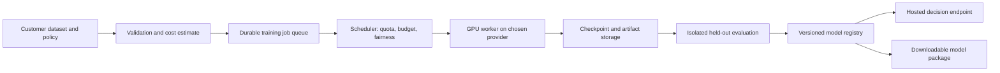

# Building a credible, trainable decision service

Research checked 25 September 2026. This is a product and experimental plan, not a report of experiments already run. No training, installation, inference, or GPU provisioning was performed. The earlier model-download/config work is stopped.

## Recommendation

Build an **exportable, customer-specific decision gate for agent tool calls**. Start with one workflow where an incorrect action has a measurable cost and a correct action has an observable outcome. Prove that customization improves the safety–utility tradeoff before expanding the model or buying substantial compute.

The product promise should be: “Bring your policy and examples; receive a versioned allow/deny/escalate model, a held-out evaluation, and a deployable artifact.” Offer hosted inference and training alongside self-hosting. The defensible asset is the customer evaluation and adaptation workflow, not simply exposing class probabilities through an API.

Treat “Jev as a service” as a product analogy. TypeSafe currently documents shared Jev weights and no customer fine-tuning; the public API does not give you downloadable Jev weights. Use an independently branded service built on an exportable model, and use Jev as a comparator. [TypeSafe model documentation](https://docs.typesafe.ai/models)

## 1. Where this could be useful

These are product hypotheses to validate with customers, not established market-demand findings.

| Application | Decision and evidence | Why someone might pay | Main difficulty |
|---|---|---|---|
| **Agent tool-call gate: recommended first** | Given user intent, identity, policy, relevant history, tool and arguments: allow, deny, escalate | Enable more automation without silently granting every proposed action | Requires provenance, authorization context, and multi-step testing |
| Customer-support actions | Refund eligibility, account changes, escalation, evidence completeness | Reduce manual review while controlling incorrect approvals | Policy exceptions and incomplete customer records |
| Document/workflow routing | Choose queue, flag missing evidence, route expensive cases to a stronger model | High volume, measurable latency and cost | Rules or a conventional classifier may already suffice |

A concrete first demonstration: an agent can read tickets and draft responses, but sending an attachment externally or changing a customer record passes through your gate. Evaluate whether the action matches the user's authorized task and the tenant's policy. A harmless-looking action can still be unauthorized; a document discussing attacks can be entirely legitimate.

Avoid starting with a universal “makes agents safe” promise. Also avoid making the learned model the sole authority for permissions. Enforce identity, tenant boundaries, tool allowlists, monetary limits, and resource access deterministically. The learned component handles contextual judgments within those boundaries.

## 2. What credible evidence looks like

Make the claim before selecting the winner. Example: “For support-agent email and record-update tools, under this policy and attack budget, our gate reduces unauthorized actions while preserving legitimate task completion.” State the covered tools, languages, context lengths, and exclusions.

Compare these systems on identical cases:

1. Existing workflow and deterministic rules alone.
2. Rules plus an existing prompt-injection detector, such as the open detector baselines listed by PINT.
3. Rules plus a frozen Laya decision model.
4. Rules plus supervised fine-tuning of the same Laya checkpoint.
5. The same model with your proposed additional RL objective.
6. A stronger hosted model or Jev as a quality reference; optionally djev as an open, larger alternative.

Use task-appropriate prompts and tune each on development data. Compare entire deployed systems as well as the isolated classifier. The rules-only baseline tells you whether ML is necessary; the supervised baseline tells you whether RL is necessary. [PINT baseline implementations and results](https://github.com/lakeraai/pint-benchmark)

### Dataset design

Start with a proposed pilot corpus of 2,000–5,000 human-reviewed decision cases across two or three design partners. This is enough to discover failure modes, not certify a very low incident rate. Include allowed actions, prohibited actions, ambiguous cases requiring review, and missing-context cases. Label the policy clause and evidence behind each decision. Have a second reviewer adjudicate disagreements on the test set.

Split by whole workflow, document family, customer, and attack family where applicable. Keep training, development, calibration, and final testing separate. Hold out at least one customer or substantially different policy for a transfer test. Keep template variants together; a paraphrase of a training attack is not convincing independent evidence. For per-customer fine-tuning, use that customer's earlier data and test on later workflows.

Use public benchmarks for comparability, then a private test set for deployment relevance. Keep private holdout labels outside the training and reward-generation pipeline. Synthetic cases can expand training coverage; their generator must not be the only judge of final performance.

### Metrics that decide whether it works

| Metric | What to report |
|---|---|
| Unauthorized execution rate | Prohibited actions actually executed / prohibited action opportunities; also episode-level attack success |
| Legitimate task success | Completed authorized tasks / benign tasks; detects a gate that simply blocks everything |
| False-block rate | Allowed actions denied / allowed actions; report escalation separately |
| Coverage and selective risk | Fraction auto-decided, and error rate among those decisions; plot their tradeoff |
| Calibration | Brier score, negative log-likelihood, reliability plot, and ECE with binning specified |
| Service performance | End-to-end p50/p95/p99, decisions/second, errors, and cost/1,000 decisions at stated input lengths and concurrency |
| Review burden | Escalations/1,000 decisions, review time, and overrides |

Use confidence intervals and paired comparisons; resample whole workflows when decisions share a trajectory. Report worst relevant slices, not just pooled averages. Token throughput is secondary for this product: a decision latency includes serialization, network, queueing, and inference.

Illustrative statistical check: zero failures in 3,000 independent representative prohibited opportunities gives an approximate one-sided 95% upper bound of 0.1% under a binomial model, not proof of zero risk. Correlated attacks or distribution shift invalidate a simplistic interpretation. Repeated variants of one attack do not buy 3,000 independent trials.

### Proposed investment gates

These are starting acceptance criteria to agree with pilot customers, not observed results or universal safety thresholds:

- At least 50% relative reduction in unauthorized execution versus the strongest deployable baseline, with uncertainty reported and enough failures in the baseline to make the comparison informative.
- No more than a two-percentage-point loss in benign task completion, with escalation burden explicitly budgeted.
- A useful coverage level agreed in advance; “escalate everything” must fail acceptance.
- Warm p95 below 150 ms for the agreed short-input workload, measured end to end in the target region. Report cold starts separately.
- Positive economics after GPU idle time, review costs, data labeling, storage, and support.
- RL must improve the safety–utility tradeoff beyond supervised training across multiple seeds. Otherwise ship supervised training.

Publish a model/system card with exact versions, splits, thresholds, attack budget, failure examples, hardware, costs, and raw per-case results where data rights allow. Have an external evaluator run the frozen release. Follow this with a customer shadow deployment, then limited enforcement with rollback. A benchmark score supports a bounded claim; it is not a security certification.

## 3. Benchmarks to use, and their limits

| Benchmark / harness | Use here | What it cannot establish |
|---|---|---|
| [JevBench](https://github.com/fstandhartinger/jevbench) | Typed-decision correctness, output behavior, probability quality and service comparisons under its published methodology | Real customer authorization or robust protection of an executing agent. Pin the suite version; do not merge scores across revisions |
| [AgentDojo](https://github.com/ethz-spylab/agentdojo), [NeurIPS 2024 paper](https://arxiv.org/abs/2406.13352) | Main public system test: tool-using agents exposed to untrusted data; measure attack success alongside legitimate task utility | Full coverage of your integrations or every adaptive attacker. Insert the gate into the action path and keep the underlying agent fixed |
| [PINT](https://github.com/lakeraai/pint-benchmark) | Prompt-injection classification and benign lookalikes; multilingual examples | Whether a particular action is authorized or whether a full workflow remains safe. The linked Lakera repository was archived in August 2026; pin it and check successor maintenance before integration |
| [HarmBench](https://arxiv.org/abs/2402.04249) | Supplement if you also protect generated content; established harmful-behavior/red-team evaluation | Tool authorization. Adapting its examples into classifier labels creates a derived task, not the original benchmark score |
| [NVIDIA garak](https://github.com/NVIDIA/garak) | Repeatable vulnerability probes and regression discovery against a supported service adapter | A fixed, exhaustive security benchmark or a certificate; record exact probes, detectors and versions |
| Private customer workflow suite | Actual policies, correct arguments, resource permissions, ambiguous requests, escalation outcomes | Generalization beyond the sampled customers and threat model |

Add targeted tests for attacker-controlled tool responses, policy impersonation inside documents, omitted context, reordered options, renamed fields, multilingual content, long inputs, and sequences of individually plausible actions that jointly violate policy. Include adaptive attackers who see the defense and have a fixed query budget. Report success per attack episode and budget, not merely per submitted string.

## 4. GPUs: access, scale, and queues

There are two different scaling problems: many independent customer fine-tunes, and one large distributed training run. Independent jobs can use a changing pool of single GPUs. A tightly coupled run needs compatible GPUs allocated together and fast interconnects; an arbitrary collection of marketplace GPUs is not equivalent.

| Provider | Relevant verified capability | Fit and qualification |
|---|---|---|
| **Prime Intellect** | On-demand single-node and multi-node GPU offers; separate Lab hosted training and open prime-rl tooling | Strong first place to investigate for training capacity. Compare raw GPU rental with managed RL; ask for regional supply, quotas, interruption policy and reserved capacity. Marketplace prices are live, not a capacity guarantee. [GPU marketplace](https://app.primeintellect.ai/dashboard/on-demand-gpus) |
| **Runpod** | GPU Pods, distributed cluster products, and Serverless queue-based endpoints | Pods/clusters for sustained training; Serverless for suitable inference or bounded async jobs. Its endpoint queue does not replace your customer job ledger. Confirm execution limits and persistence for the intended job. [Product documentation](https://docs.runpod.io/), [endpoint configuration](https://github.com/runpod/docs/blob/main/serverless/endpoints/endpoint-configurations.mdx) |
| **Modal** | GPU functions, autoscaling, GPU fallback choices and single-node multi-GPU training | Convenient for many independent jobs and evaluations. Current GPU docs describe multi-node training as private beta; verify access before committing a distributed run. [GPU docs](https://modal.com/docs/guide/gpu), [autoscaling](https://modal.com/docs/guide/scale) |

**My initial choice:** one primary provider for a few custom training workers, plus a provider-independent job queue. Request expanded quota when pilot workload exists. If you need tens or hundreds of GPUs at a specific time, obtain a capacity commitment; “on demand” does not promise immediate fleet availability.

For the approximately 421M-parameter Laya path, begin profiling on one 24–48 GB GPU. This is a planning estimate, not a tested memory minimum; batch size, optimizer and sequence length determine fit. For diffusion, do not budget from “4B active”: the model stores approximately 26B parameters. The current djev inference recipe recommends a B200 and says BF16 weights alone occupy roughly 52 GB. That recipe is inference support, not proof of a working diffusion fine-tuning stack. [djev runtime](https://github.com/Davipar/djev-dev/blob/main/docs/runtime.md)

First budget in GPU-hours. Example arithmetic, **not a provider quote**: 100 jobs × 2 hours × 1 GPU = 200 GPU-hours; at an assumed $2/GPU-hour, compute is $400 before startup, evaluation, retries, storage and other costs. Replace both runtime and price with measured/quoted values. More GPUs improve throughput only when you have queued work and the workload scales.

### Queue architecture

Keep customer state in your own database: queued, provisioning, running, evaluating, ready, failed, cancelled. Workers acquire expiring leases and heartbeat. Checkpoints go to persistent object storage; retries resume from a recorded checkpoint and must be idempotent. Set per-tenant GPU-hour budgets, concurrency limits, cancellation, maximum runtimes, and weighted-fair scheduling. Publish queue age and an estimated start window, not a guaranteed ETA when capacity is unreserved.

Keep the training queue separate from low-latency inference capacity. Maintain warm inference replicas for paying latency commitments; use scale-to-zero for workloads that tolerate startup delay. Customer jobs should use curated training recipes and isolated data access; accepting arbitrary uploaded code is a separate product with a much larger operational burden.

## 5. Training: what to build yourself

Build your **decision-training and evaluation layer**. Initially reuse PyTorch and established distributed infrastructure instead of implementing GPU collectives, schedulers, and general-purpose RL from scratch.

The components worth owning are the policy/case format, model adapters, proper probability losses, abstention objective, calibration, workflow simulators, reward validation, export format, and reproducible experiment records. Laya's published fine-tuning notebook is a concrete starting point, but its combined objective includes auxiliary supervision; reproduce and ablate it rather than assuming “RL” explains the improvement. [Laya training notebook](https://github.com/NandhaKishorM/laya/blob/main/notebooks/laya_finetune_typed_decisions_2xT4_kaggle.ipynb)

### A staged training experiment

1. **Frozen model plus threshold calibration:** establish the zero-training baseline and failure taxonomy.
2. **Supervised adaptation:** train on human-reviewed allowed/denied/escalated examples, with cross-entropy or soft-label targets where warranted. Fit calibration on separate data. Do not treat customer clicks as infallible labels.
3. **Cost-sensitive decision rule:** given calibrated class probabilities and an agreed cost matrix, choose the action with lowest expected cost; escalate when review has lower expected cost. Keep probability learning separate from action costs where possible. Class weighting alone can distort posterior interpretation, so reevaluate calibration.
4. **RL only for an identified gap:** use sandbox workflow outcomes when sequence-level consequences or partially observed feedback cannot be captured adequately by the supervised task. Compare against equal-budget supervised data expansion.

If every option has a known target probability distribution, a differentiable proper scoring loss gives a direct learning signal; sampling an action and applying policy gradients is not automatically better. If only the selected action's outcome is observed, contextual-bandit/off-policy methods become relevant, but logged action propensities and coverage matter. If outcomes depend on multiple actions, use an episodic environment. These are three different data regimes.

For sequential RL, specify rewards and constraints explicitly: successful authorized completion, severity-weighted violations, review burden, and latency. Publish the weights and constraint thresholds. A scalar reward can hide unacceptable tradeoffs, so enforce hard policies outside the learned policy and evaluate violations separately. Check for reward hacking, shortcut learning and training-evaluation leakage.

### Platform compatibility

Prime's hosted training docs list supported models and LoRA RL using Verifiers environments. They do not list Laya or DiffusionGemma. Its open prime-rl framework supports large-scale training, but that does not establish compatibility with a custom bidirectional classifier head or diffusion objective. Treat both as integration work until a gradient update, checkpoint save/reload, and held-out evaluation have been demonstrated. [Prime training documentation](https://docs.primeintellect.ai/verifiers/training)

Use ordinary custom GPU jobs for Laya first. Consider prime-rl/Verifiers if you select a supported generative policy and need agentic rollouts; do not force a classifier into a completion-oriented trainer merely to use an RL brand. No source reviewed establishes a turnkey reproduction of TypeSafe's proprietary RLCD. Describe your actual objective and publish its recipe under your own name.

The customer export must include base-model identity/license, weights or adapter, custom head, tokenizer, decision schema, calibration parameters, policy version, thresholds, and evaluation report. An adapter alone is not a self-contained model. Specify base-model acquisition and supported runtime; verify hosted/exported prediction parity within a declared tolerance. Check each selected model's redistribution terms before committing the product contract.

## 6. A practical proof sequence

| Stage | Deliverable | Spend / stop decision |
|---|---|---|
| Define | Two or three design partners, one workflow, explicit errors and costs, agreed test protocol | Stop or narrow scope if nobody supplies examples or values the resulting decision |
| Baseline | Frozen private holdout, rules and model comparisons, measured service profile | Stop model work if rules solve it adequately |
| Adapt | Supervised fine-tune and calibration; repeated runs; one held-out customer/policy | Scale data only if adaptation improves the tradeoff |
| Challenge | AgentDojo integration, adaptive attacks, external review, published limitations | Fix integration bypasses before optimizing benchmark averages |
| Pilot | Shadow traffic, review burden, export parity, limited enforcement and rollback | Provision more GPUs when customer demand and job economics justify it |
| RL experiment | Same-data/same-budget ablation against supervised training | Keep RL only if the measured improvement justifies complexity |

**The credibility test:** can a customer reproduce a bounded improvement on their own held-out workflows, inspect the remaining failure modes, export the same model, and operate it at a tolerable cost? That is stronger evidence for this business than a large GPU allocation or a new name for the training algorithm.
